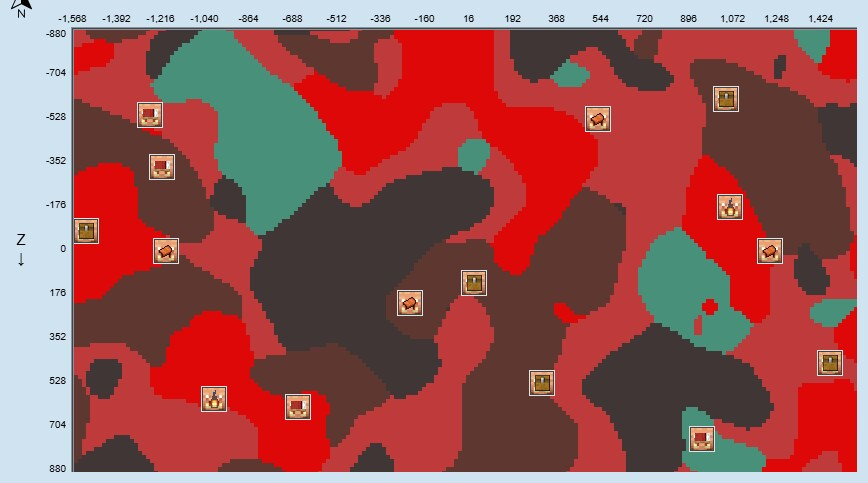
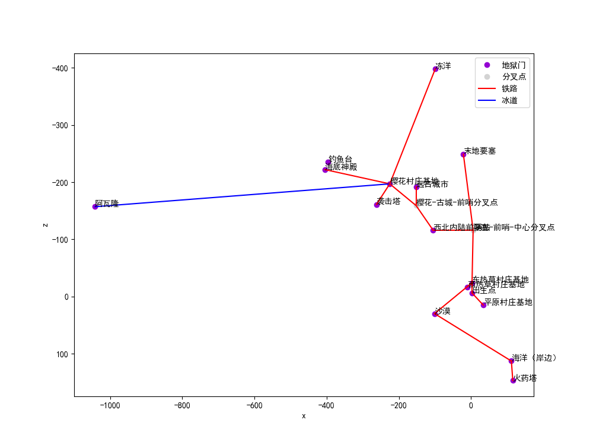

---

title: 信息公示

---

坐标表示：

- 二元组 (x, z)
- 三元组 (x, y, z)

## chunkbase

### 结构

#### 村庄

- 西热带草原村庄 (-192, -240)
- 东热带草原村庄 (80, -160)
- 平原村庄 (272, 112)
- 西北前哨站旁村庄 (-1024, -928)
- 樱花村庄 (-1888, -1584)

#### 末地要塞

- 传送门房间 (-180, 37, -1979)

#### 掠夺者前哨站

- 沿东南海前哨站 (2112, 352)
- 西北内陆前哨站 (-784, -1024)

#### 末地城（打钩或星号*代表鞘翅还在）

- [ ] (1336, 744)
- [ ] (440, 1032)
- [ ] (2008, 376)
- [ ] (2312, 712)
- [ ] (1064, 1368)
- [ ] (392, 1688)
- [ ] (1368, 2280)
- [ ] (2584, 2664)
- [ ] (1416, 2632)

#### 远古城市

- (-1128, -51, -1416)

#### 猪灵堡垒

如图

#### 海底神殿

- (1208, 1352)
- (1656, 1144)
- (-3256, -1784)

#### 女巫小屋

- (696, -1288)

#### 林地府邸

- (4504, -3576)
- (-4728, -5576)
- (-3336, -7272)

### 群系

#### 沙漠

- (-800, 250)

#### 海洋

- 东南海 (1800, 750)
- 南海 (700, 1500)

#### 暖海

- (-1300, 500)

#### 樱花树林

- 大樱花林 (-1000, -1300)
- 小樱花林 (-480, -1180)
- 村庄樱花林 (-1800, -1600)
- 东北樱花林 (1600, -2900)

#### 冻洋

- (-800, -3200)

## 基地

- 东热草村庄基地 (77, 64, -227)
    - zhdbk
    - DingerBtn
    - Altria
    - poison4046184
- 西热草村庄基地 (-182, 105, -216)
    - AwfulLime473897
- 平原村庄基地 (279, 69, 124)
    - yi985
    - XChengYa
- 樱花村庄基地 (-1827, 124, -1588)
    - zhdbk
    - DingerBtn
    - poison4046184

## 地狱交通

### 节点

| 节点名     | 主世界坐标               | 地狱坐标              |
|---------|---------------------|-------------------|
| 出生点     | (51, 64, -4)        | (3, 68, -6)       |
| 东热草村庄基地 | (77, 64, -227)      | (3, 65, -34)      |
| 西热草村庄基地 | (-182, 105, -216)   | (-10, 67, -16)    |
| 平原村庄基地  | (279, 69, 124)      | (34, 70, 15)      |
| 末地要塞    | (-180, 37, -1979)   | (-21, 72, -249)   |
| 沙漠      | (-800, 72, 250)     | (-101, 63, 30)    |
| 西北内陆前哨站 | (-835, 63, -913)    | (-105, 68, -116)  |
| 远古城市    | (-1129, -42, -1421) | (-152, 38, -192)  |
| 樱花村庄基地  | (-1827, 124, -1588) | (-225, 75, -197)  |
| 海洋（岸边）  | (957, 64, 977)      | (112, 59, 113)    |
| 火药塔     | (972, 63, 1116)     | (116, 46, 147)    |
| 海底神殿    | (-3264, 63, -1792)  | (-405, 94, -222)  |
| 冻洋      | (-972, 63, -3205)   | (-99, 82, -398)   |
| 阿瓦隆     | (-8357, 310, -1163) | (-1042, 93, -157) |
| 袭击塔     | (-2134, 63, -1339)  | (-262, 108, -161) |
| 钓鱼台     | (-3160, 64, -1881)  | (-396, 94, -235)  |

### 线路

- --- 这是铁路
- [---]() 这是冰道

---

- 平原村庄基地 --- 出生点 --- 东热草村庄基地 ---(6, 67, -116)===
    - --- 末地要塞
    - --- 西北内陆前哨站
- 西北内陆前哨站 ---(-152, 68, -159)===
    - --- 远古城市
    - --- 樱花村庄基地
- 东热草村庄基地 --- 沙漠 --- 海洋（岸边）--- 火药塔
- 樱花村庄基地 --- 海底神殿 钓鱼台
- 樱花村庄基地 --- 冻洋
- 樱花村庄基地 [---]() 阿瓦隆
- 樱花村庄基地 --- 袭击塔

### 图示

## 全服公有财产

- 东热草村庄基地 (77, 64, -227)
    - 自动瓜田 (44, 62, -226)
    - 梯田 (48, 75, -182)

欢迎补充！
